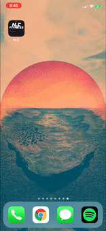
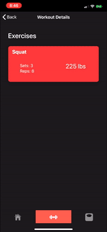
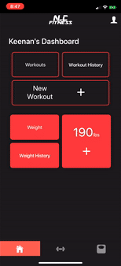

# NLCFitness

This app was built using Angular and Ionic with Firebase as the backend.

## PWA
- This app has some PWA features:
- When added to homescreen it looks and feels like native app from the app store.
- 

## Workout Tracking
- This app can track your workouts and store them in a simple, easy to use interface.
- 

## Weight Tracking
- You can also track your weights.
- Your previous weights are laid out in a list as well as a chart showing your progression.
- 

## Profile
- You can also view and set your profile information.
- This could potentially be used to share with other users.
- 
